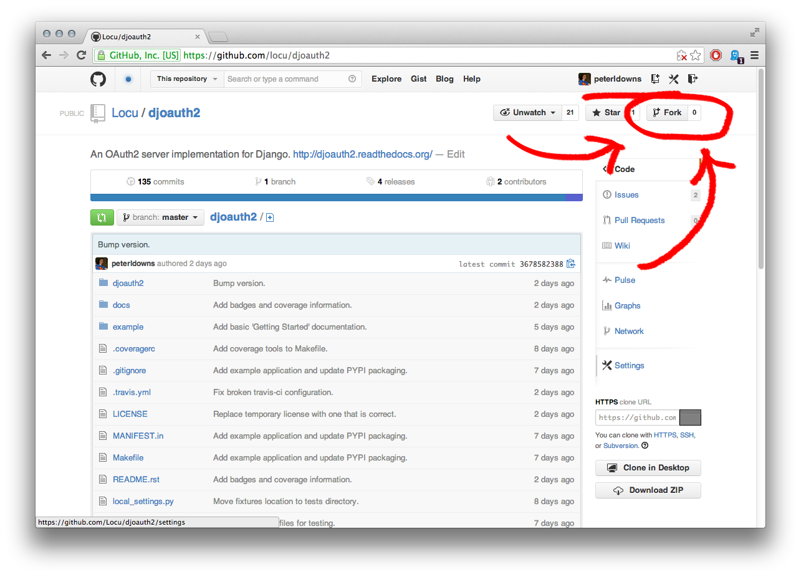
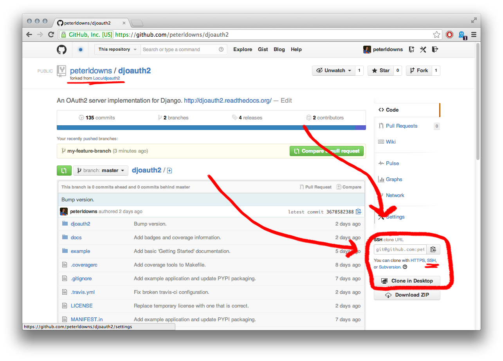
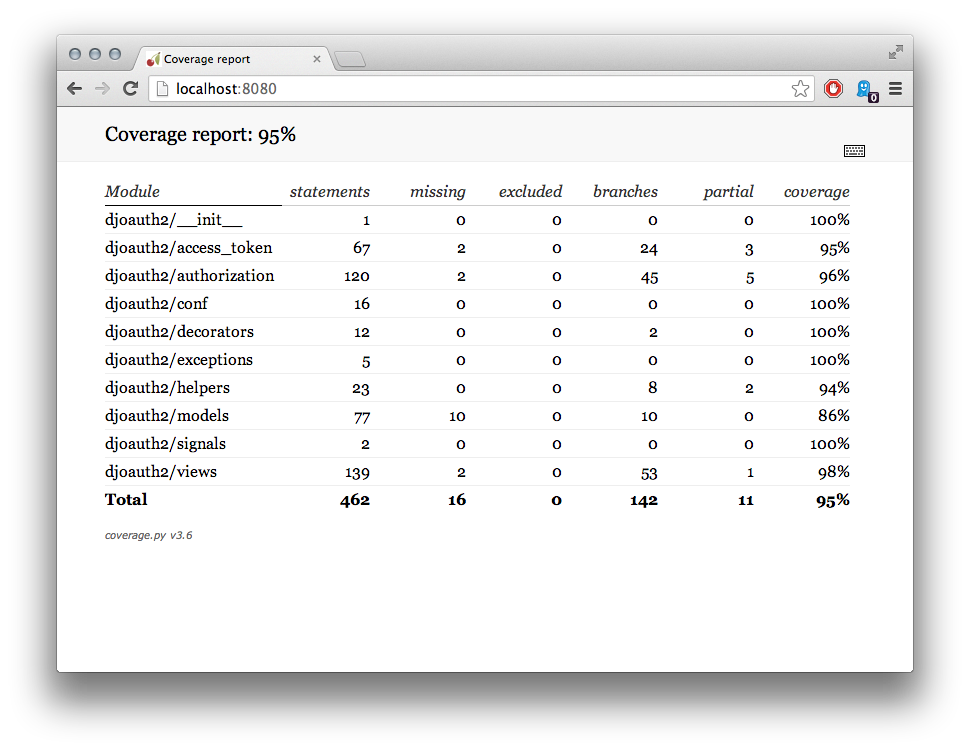
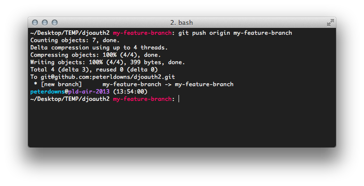
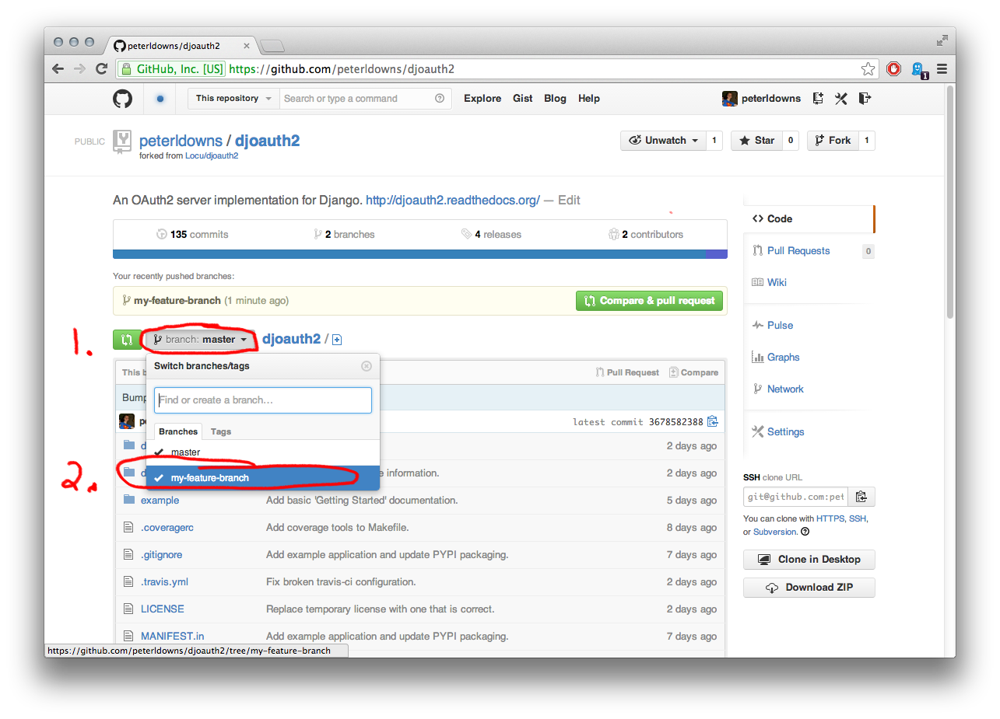
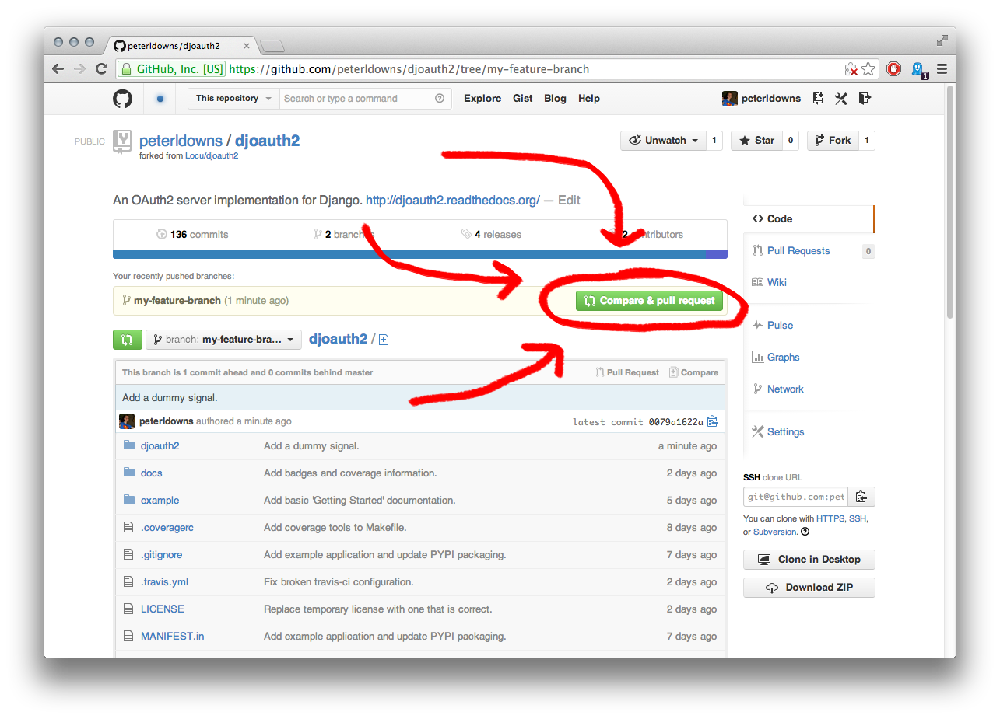
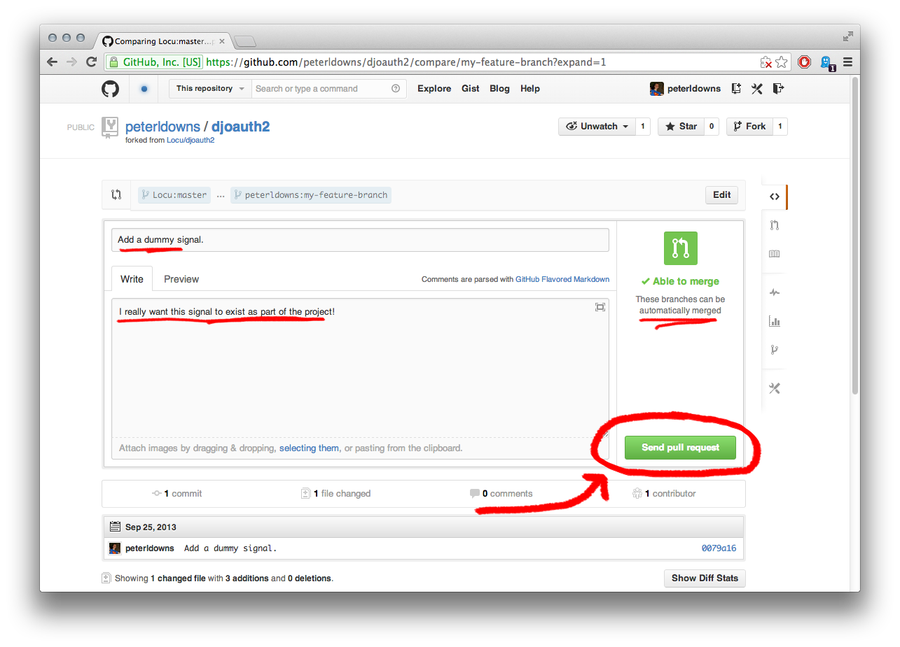

Contributing
============
We ``<3`` contributions; please feel free to check out the code!
In general, this is a quick overview of how to contribute to DJOAuth2
using the standard Github pull-request flow. For more information,
`Github has a nice overview here`_.

Fork and clone the repository
-----------------------------

The first step of contributing is creating your own copy ("fork") of the main
DJOAuth2 repository. Do this through the Github web interface:

Now that you have a copy, copy the "SSH clone URL" from the right-most column:

and run the following commands from a local terminal:

.. code-block:: bash

  cd ~

  # The git@github.com URL is the "SSH clone URL" that you copied.
  git clone git@github.com:<YOUR_USER_NAME>/djoauth2.git
  cd djoauth2

  # Install development dependencies inside a new virtualenv
  make dev-env

  # Activate the virtualenv so that you have access to the dependencies that
  # were installed.
  . dev-env/bin/activate

Now you're ready to contribute!

Making changes
--------------
First, check out a new branch locally:

.. code-block:: bash

  git checkout -b 'my-feature-branch'

Make your changes. Don't forget to update the tests! Please follow our style
guide:

* 2-space indents
* All indents are spaces, not tabs.
* Wrap lines at 80 characters.

.. code-block:: bash

  vim djoauth2/...
  vim djoauth2/tests/...

Schema Migrations
~~~~~~~~~~~~~~~~~
If your changes touched the ``models.py`` file, you must attempt to generate a
`South migration`_ in case the schema has changed.

.. code-block:: bash

  ./generate_migrations.py

  # Now, test to see that they apply without an error.
  ./generate_migrations.py --test-migrations

It's important that for backwards-compatibility reasons you use South version 0.7.6
to generate migration files. This is the version included in the `dev-env` built
by the `make dev-env` command.

Testing
~~~~~~~
DJOAuth2 is a standalone Django application, which can be hard to test. To
obviate a need for installing and re-installing inside of a test project, we
provide a bootstrap `manage.py` script for testing.
To run the tests, enter your shell and run:

.. code-block:: bash

  # Run all of the tests
  ./manage.py test djoauth2
  # or
  make tests

  # Run a group of tests
  ./manage.py test djoauth2.tests.TestAuthorizationCodeEndpoint

  # Run an individual test
  ./manage.py test djoauth2.tests.TestAuthorizationCodeEndpoint.test_get_requests_succeed

The `manage.py` file works just like ``the standard manage.py file`` that exists in most
Django applications. It uses the same settings as our tests and allows for easy access
to an interactive shell for exploring the code

.. code-block:: bash

  # Open an interactive interpreter within a Django environment
  ./manage.py shell

Coverage
~~~~~~~~
While we don't fetishize 100% coverage, it can be useful to double check that
testing actually exercised the code that you added.

To get a coverage report, run ``make coverage``.  This will output a brief
summary report in the terminal and also generate an interactive HTML version of
the report. The interactive version will display the code line-by-line and
highlight any code that was not covered by the tests.

.. code-block:: bash

  # Generate the coverage report
  make coverage

  # Fire up a webserver to view the interactive HTML version
  cd docs/coverage/
  python -m SimpleHTTPServer 8080

  # Now navigate to localhost:8080 in a browser

Updating Documentation
~~~~~~~~~~~~~~~~~~~~~~
Made changes that require documentation (hint: probably)? Rebuild the docs:

.. code-block:: bash

  make docs

And view them in your browser locally:

.. code-block:: bash
  
  cd docs/_build/html
  python -m SimpleHTTPServer 8080

  Now navigate to localhost:8080 in a browser

By the way, if you have any questions, concerns, or complaints about the
current documentation, **please** let us know and/or submit a pull request!
We're committed to making the docs as easy to use as possible, so if
something is not working we'd love to hear it.

Committing
~~~~~~~~~~

Once your changes are finished (including tests and documentation) it's time to commit them:

.. code-block:: bash

  git commit -a -m "Add my new feature."

Submitting a pull request
-------------------------

Once your changes are locally committed and tested, it's time to submit a pull
request to get your changes reviewed and merged upstream.  Again, `Github has a
nice overview here`_.

* Push your changes to your github repository:

.. code-block:: bash
  
  git push origin my-feature-branch

* In Github, switch to ``my-feature-branch``

* Click on the large green "compare & pull request" button:

* Write up a nice explanation of your changes and fire it off!

.. _`Github has a nice overview here`: https://help.github.com/articles/fork-a-repo
.. _`South migration`: http://south.readthedocs.org/en/latest/whataremigrations.html#what-are-migrations
