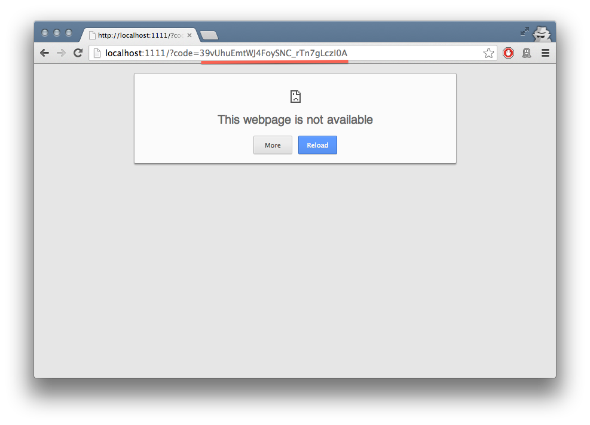

Quickstart Guide
================

This guide will help you get set up to use ``djoauth2`` with an existing Django
project. The code repository also includes `a finished example`_ for
comparison; that page includes instructions for setting it up.

Requirements
------------

DJOAuth2 has been tested and developed with the following:

* Python 2.7.2
* Django 1.4+
* `Django AppConf`_ 0.6

DJOAuth2 uses `South`_ for migrations. For the Django 1.4.X series we support
South version 0.7.6; for Django 1.5.X we support South version 0.8.2.

Installation
------------

1. Install the project with ``pip``:

.. code:: bash

	pip install djoauth2

Adding ``djoauth2`` to an existing application
-----------------------------------------------

First, add ``djoauth2`` to the ``INSTALLED_APPS`` list in your project's
``settings.py``:

.. code:: python

  INSTALLED_APPS = [
    'django.contrib.auth',
    'django.contrib.contenttypes',
    'django.contrib.sessions',
    'django.contrib.sites',
    'django.contrib.messages',
    'django.contrib.staticfiles',
    'django.contrib.admin',
    'south',
    # ...
    # ... your other custom apps
    # ...
    'djoauth2',
  ]

If you're not already using `South`, make sure to also add ``south`` to the
list of ``INSTALLED_APPS``.

Optionally, for developing without SSL (**NOT for production code**), add the
following setting to turn off ``djoauth2``'s SSL-enforcement:

.. code:: python

	DJOAUTH2_SSL_ONLY = False

**Do not** set this to ``False`` in production code: SSL is mandated by the
specification.  This value is only designed to make it easier to *develop* with
OAuth.

Install the models:

.. code:: bash

  python manage.py syncdb
  python manage.py migrate djoauth2

Run the tests — they should all pass!

.. code:: bash

	python manage.py test djoauth2

Now that we know that ``djoauth2`` works, it's time to set up the URL endpoints
so that clients can make requests. Although the library handles all of the
logic for us, we will have to set up some endpoints — to do so, we'll update
our project's ``urls.py`` file and add an application to hold the
endpoints.  For the purposes of this demo we're going to call it
``oauth2server``, but you could name it anything you'd like.

Here's what the ``urls.py`` file from our project should look like:

.. code:: python

  # coding: utf-8
  from django.conf.urls import patterns, include, url
  from django.contrib import admin

  admin.autodiscover()

  urlpatterns = patterns('',
      # Admin, for creating new Client and Scope objects. You can also create
      # these from the command line but it's easiest from the Admin.
      url(r'^admin/', include(admin.site.urls)),

      # The endpoint for creating and exchanging access tokens and refresh
      # tokens is handled entirely by the djoauth2 library.
      (r'^oauth2/token/$', 'djoauth2.views.access_token_endpoint'),

      # The authorization endpoint, a page where each "resource owner" will
      # be shown the details of the permissions being requested by the
      # "client".
      (r'^oauth2/authorization/$', 'oauth2server.views.authorization_endpoint'),

      # The page to show when Client redirection URIs are misconfigured or
      # invalid. This should be a nice, simple error page.
      (r'^oauth2/missing_redirect_uri/$', 'oauth2server.views.missing_redirect_uri'),

      # An access-protected API endpoint, which we'll define later.
      (r'^api/user_info/$', 'api.views.user_info'),
  )

As you can see, it references an endpoint defined by ``djoauth2`` (the
``access_token_endpoint``) and two others (``authorization_endpoint`` and
``missing_redirect_uri``) that we say exist in our ``oauth2server``
application. The ``oauth2server`` application only exists to define those
two views — here's what the ``views.py`` file should look like:

.. code:: python

  # coding: utf-8
  from django.shortcuts import render
  from django.http import HttpResponse
  from django.forms import Form

  from djoauth2.authorization import make_authorization_endpoint

  def missing_redirect_uri(request):
    """ Display an error message when an authorization request fails and has no
    valid redirect URI.

    The Authorization flow depends on recognizing the Client that is requesting
    certain permissions and redirecting the user back to an endpoint associated
    with the Client.  If no Client can be recognized from the request, or the
    endpoint is invalid for some reason, we redirect the user to a page
    describing that an error has occurred.
    """
    return HttpResponse(content="Missing redirect URI!")

  authorization_endpoint = make_authorization_endpoint(
    # The URI of a page to show when a "client" makes a malformed or insecure
    # request and their registered redirect URI cannot be shown.  In general, it
    # should simply show a nice message describing that an error has occurred;
    # see the view definition above for more information.
    missing_redirect_uri='/oauth2/missing_redirect_uri/',

    # This endpoint is being dynamically constructed, but it also needs to know
    # the URI at which it is set up so that it can create forms and handle
    # redirects, so we explicitly pass it the URI.
    authorization_endpoint_uri='/oauth2/authorization/',

    # The name of the template to render to show the "resource owner" the details
    # of the "client's" request. See the documentation for more details on the
    # context used to render this template.
    authorization_template_name='oauth2server/authorization_page.html')

The template passed to the ``make_authorization_endpoint`` helper will be
rendered with the following context:

* ``form``: a Django ``Form`` that may hold data internal to the ``djoauth2``
  application.
* ``client``: The :py:class:`djoauth2.models.Client` requesting access to the
  user's scopes.
* ``scopes``: A list of :py:class:`djoauth2.models.Scope`, one for each of
  the scopes requested by the client.
* ``form_action``: The URI to which the form should be submitted -- use this
  value in the ``action=""`` attribute on a ``<form>`` element.

The template in our example application is included below.  Please
note that it is important to include the ``{{form}}`` context —
``djoauth2`` may use this to hold information across authorization requests.
Currently, the ``user_action`` values must be ``"Accept"`` and ``"Decline"``.

.. code:: html+django

  
    
  

  
{{client.name}} is requesting access to the following scopes:

  <ul>
    
    <li> <b>{{scope.name}}</b>: {{scope.description}} </li>
    
  </ul>

  <form action="{{form_action}}" method="POST">
    
    
 {{form}} 

    <input type="submit" name="user_action" value="Decline"/>
    <input type="submit" name="user_action" value="Accept"/>
  </form>

And with that, all of the OAuth routes are implemented! All that's left is to
set up an API endpoint that requires clients to have been authorized via OAuth
— we referenced it in the URL conf by the name ``api.views.user_info``.  We're
going to create a new application, ``api``, to hold this view. In your own app,
there's no need to create a new application, and you can simply use existing
API views.

The ``api/views.py`` file:

.. code:: python

  # coding: utf-8
  import json

  from django.http import HttpResponse
  from django.views.decorators.csrf import csrf_exempt

  from djoauth2.decorators import oauth_scope

  @csrf_exempt
  @oauth_scope('user_info')
  def user_info(access_token, request):
    """ Return basic information about a user.

    Limited to OAuth clients that have received authorization to the 'user_info'
    scope.
    """
    user = access_token.user
    data = {
        'username': user.username,
        'first_name': user.first_name,
        'last_name': user.last_name,
        'email': user.email}

    return HttpResponse(content=json.dumps(data),
                        content_type='application/json',
                        status=200)

(Any existing endpoint can be easily protected by our :py:class:`@oauth_scope`
decorator; just modify the signature so that it expects a
:py:class:`djoauth2.models.AccessToken` as the first argument. For more
information, see the :py:class:`djoauth2.decorators.oauth_scope`
documentation.)

With our code all set up, we're ready to set up the DB and start the webserver:

.. code:: bash

  python manage.py syncdb
  python manage.py migrate
	python manage.py runserver 8080

Now, log in to the admin page and create a ``Client`` and a ``Scope``. Set up
the client so that the ``redirect_uri`` field is a valid URI under your
control.  While testing we often use URIs like ``http://localhost:1111`` that
don't point to any server. The scope's ``name`` should be the same as that used
to protect the ``api.views.user_info`` endpoint — in this case, ``user_info``.

Interacting as a Client
-----------------------

We're ready to begin making requests as a client! In this example, we'll grant
our client access to a scope, exchange the resulting authorization code for an
access token, and then make an API request. This is adapted from our example
project's ``client_demo.py`` script, which you can edit and run yourself. Go
and `check it out`_!

The first step is to grant our client authorization. Open a browser and visit
the following URL:

.. code::

  http://localhost:8080/oauth2/authorization/?
    scope={the name of the scope you created}&
    client_id={the 'key' value from the Client you created}&
    response_type=code

If it worked, you should see the results of rendering your authorization
template. If you confirm the request, you should be redirected to the
registered client's ``redirect_uri``. If you use a value like
``http://localhost:1111``, your browser will show a "could not load this page"
message. This is unimportant — what really matters is the ``code`` GET
parameter in the URl. This is the value of the authorization code that was
created by the server.

We must now exchange this code for an access token. We do this by making a
``POST`` request like so:

.. code::

  POST http://localhost:8080/oauth2/token/ HTTP/1.1
  Authorization: Basic {b64encode(client_id + ':' + client_secret)}
  
  code={authorization code value}&grant_type=authorization_code

The ``Authorization`` header is used to identify us as the client that was
granted the authorization code that we just received. The value should be the
result of joining the client ID, a ``:``, and the client secret, and encoding
the resulting string with base 64. In Python, this might look like:

.. code:: python

  import requests
  from base64 import b64encode
  token_response = requests.post(
    'http://localhost:8080/oauth2/token/',
    data={
      'code': 'Xl4ryuwLJ6h2cTkW5K09aUpBQegmf8',
      'grant_type': 'authorization_code',
    },
    headers={
      'Authorization': 'Basic {}'.format(
          b64encode('{}:{}'.format(client_key, client_secret))),
    })
  assert token_response.status_code == 200

This will return a JSON dictionary with the access token, access token
lifetime, and (if available) a refresh token. Continuing the example from
above:

.. code:: python

  import json

  token_data = json.loads(token_response.content)
  access_token = token_data['access_token']
  refresh_token = token_data.get('refresh_token', None)
  access_token_lifetime_seconds = token_data['expires_in']

With this access token, we can now make API requests on behalf of the user who
granted us access! Again, continuing from above:

.. code:: python

  api_response = requests.post(
    'http://localhost:8080/api/user_info/',
    headers={
      'Authorization': 'Bearer {}'.format(token_data['access_token'])
    },
    data={})
  assert api_response.status_code == 200
  print api_response.content
  # {"username": "exampleuser",
  #  "first_name": "Example",
  #  "last_name": "User",
  #  "email": "exampleuser@locu.com"}

While the access token has not expired, you will be able to continue making API
requests. Once it has expired, any API request will return an ``HTTP 401
Unauthorized``. At that point, if you have a refresh token, you can exchange it
for a new access token like so:

.. code:: python

  token_response = requests.post(
    'http://localhost:8080/oauth2/token/',
    data={
      'refresh_token': 'h9EY74_58aueZqHskUwVmMiTngcW3I',
      'grant_type': 'refresh_token',
    },
    headers={
      'Authorization': 'Basic {}'.format(
          b64encode('{}:{}'.format(client_key, client_secret))),
    })
  
  assert token_response.status_code == 200
  
  new_token_data = json.loads(token_response.content)
  new_access_token = new_token_data['access_token']
  new_refresh_token = new_token_data.get('refresh_token', None)
  new_access_token_lifetime_seconds = new_token_data['expires_in']

As long as you have a refresh token, you can continue to exchange them for new
access tokens. If your access token expires and you have lost the refresh token
value, the refresh request fails, or you were never issued a refresh token,
then you must begin again by redirecting the user to the authorization page.
  
.. _Django AppConf: https://github.com/jezdez/django-appconf
.. _South: http://south.aeracode.org/
.. _a finished example: https://github.com/Locu/djoauth2/tree/master/example
.. _check it out: https://github.com/Locu/djoauth2/blob/master/example/client_demo.py
